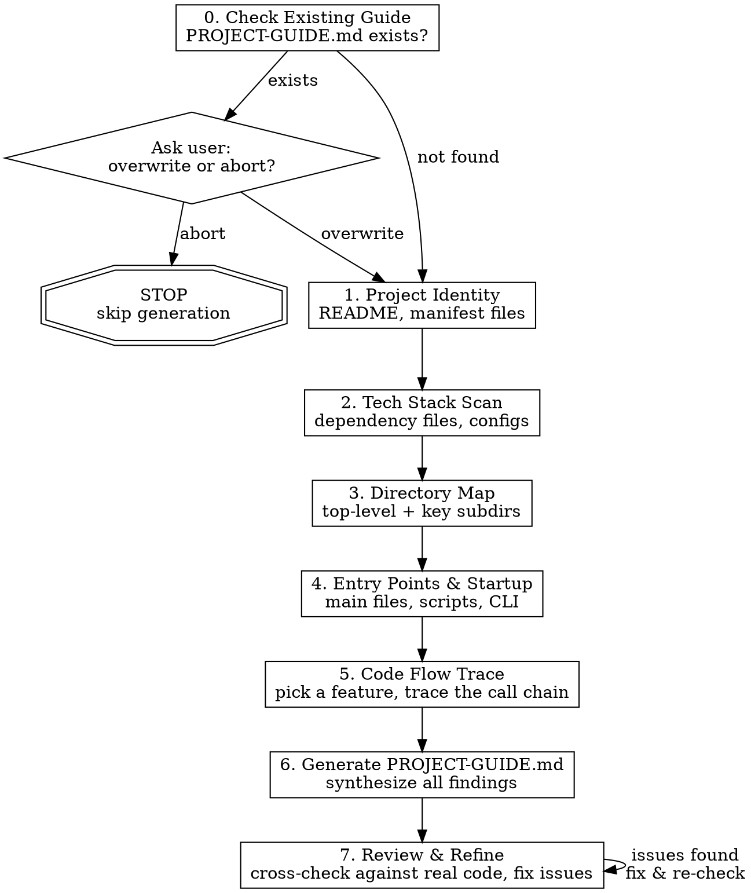

# Exploring New Project

## Overview

Systematically explore an unfamiliar codebase and produce a structured **PROJECT-GUIDE.md** in the project root. The guide gives a newcomer everything needed to start contributing: what the project does, how it's built, how it runs, and where to start reading.

## When to Use

- First time opening a new repository
- Onboarding onto an inherited or transferred project
- Before making changes to a codebase you haven't touched before
- When someone asks "what does this project do?"

## When NOT to Use

- You already understand the project well
- The project has fewer than 5 files (just read them directly)
- You only need to understand one specific file or function (use targeted exploration instead)

## Process Flow



## Checklist

You MUST create a task for each step and complete them in order.

### Step 0: Check for Existing Guide

**Goal:** Detect whether a PROJECT-GUIDE.md already exists. If so, ask the user before overwriting.

**Actions:**
- Use Glob to check if `PROJECT-GUIDE.md` exists in the project root
- **If NOT found:** proceed to Step 1
- **If found:** STOP and ask the user using AskUserQuestion:
  - "PROJECT-GUIDE.md already exists in this project. How would you like to proceed?"
  - Option A: "Overwrite" — delete the old file and regenerate from scratch
  - Option B: "Cancel" — abort the skill, keep the existing guide
- Only continue to Step 1 if the user explicitly chooses to overwrite

### Step 1: Project Identity

**Goal:** One-sentence summary of what this project does.

**Actions:**
- Read `README.md` (or `README.rst`, `README.txt`) if it exists
- Read the project manifest file — look for ONE of:
  - `package.json` (Node.js) — check `description` field
  - `pyproject.toml` or `setup.py` or `setup.cfg` (Python)
  - `Cargo.toml` (Rust) — check `description` field
  - `go.mod` (Go)
  - `pom.xml` or `build.gradle` (Java/Kotlin)
  - `*.sln` or `*.csproj` (C#/.NET)
  - `Gemfile` (Ruby)
- If no README or manifest, scan top-level files and infer from code comments and filenames

**Output:** A single sentence: "This project is a ___ that does ___."

### Step 2: Tech Stack Scan

**Goal:** Identify the core language, framework, and key third-party libraries.

**Actions:**
- Read the dependency/manifest file found in Step 1
- For each dependency category, note:
  - **Language & version** (e.g., Python 3.11, Node 18, Go 1.21)
  - **Framework** (e.g., FastAPI, Next.js, Gin, Spring Boot)
  - **Key libraries** — only the most important 5-10, grouped by purpose:
    - Database/ORM (SQLAlchemy, Prisma, GORM)
    - HTTP/API (axios, requests, gin)
    - Testing (pytest, jest, go test)
    - Build/tooling (webpack, vite, tsc)
- Check for config files that reveal tooling:
  - `.eslintrc`, `tsconfig.json`, `prettier.config.*` — JS/TS tooling
  - `Makefile`, `justfile` — build automation
  - `Dockerfile`, `docker-compose.yml` — containerization
  - `.github/workflows/`, `.gitlab-ci.yml` — CI/CD

**Output:** A structured list of language, framework, key libraries (grouped by purpose), and tooling.

### Step 3: Directory Map

**Goal:** Identify the 5-10 most important directories and their roles.

**Actions:**
- Use Glob to scan the top-level directory structure
- Use Glob to scan one level deeper into key directories (e.g., `src/`, `app/`, `lib/`)
- For each important directory, read 1-2 representative files to confirm its purpose
- Ignore standard noise directories: `node_modules/`, `__pycache__/`, `.git/`, `dist/`, `build/`, `target/`, `.venv/`, `venv/`

**Output:** A table of directory paths and their one-line descriptions. Example:

```
src/api/       — REST API route handlers
src/models/    — Database models and schemas
src/services/  — Business logic layer
tests/         — Unit and integration tests
config/        — Environment and app configuration
```

### Step 4: Entry Points & Startup Mechanism

**Goal:** How does this project run? Where is the entry point?

**Actions:**
- Look for main entry files:
  - `main.py`, `app.py`, `manage.py`, `wsgi.py` (Python)
  - `index.ts`, `index.js`, `main.ts`, `server.ts` (Node.js)
  - `main.go`, `cmd/*/main.go` (Go)
  - `Main.java`, `Application.java` (Java)
  - `Program.cs` (C#)
- Check startup scripts:
  - `package.json` → `scripts.start`, `scripts.dev`
  - `Makefile` / `justfile` → common targets like `run`, `dev`, `serve`
  - `Dockerfile` → `CMD` or `ENTRYPOINT`
  - `docker-compose.yml` → service definitions
  - `Procfile` (Heroku-style)
- Read the entry file and understand:
  - What gets initialized (config, database, routes, middleware)?
  - What starts listening (HTTP server, CLI parser, event loop)?

**Output:** Clear description of how to start the project, with the actual command and what happens when it runs.

### Step 5: Code Flow Trace (CRITICAL)

**Goal:** Pick ONE representative feature and trace its execution path from trigger to result.

This is the most valuable section — it shows how the code actually works together.

**Actions:**
- Choose the most representative feature. Good candidates:
  - An API endpoint (for web services)
  - A CLI command (for CLI tools)
  - A core function (for libraries)
  - A data pipeline step (for data projects)
- Trace the call chain step by step:
  1. Where does the request/trigger enter? (route definition, CLI handler)
  2. What middleware/interceptors does it pass through?
  3. What service/business logic gets called?
  4. What data layer (DB, file, API) does it touch?
  5. How does the response get assembled and returned?
- For EACH step, note the exact file path and key function/class name

**Output format:**

```
Example: User creates a new task via POST /api/tasks

1. Request enters at src/routes/tasks.ts:15 → `createTask` handler
2. Middleware validates auth at src/middleware/auth.ts:8 → `requireAuth()`
3. Request body validated at src/schemas/task.ts:12 → `TaskCreateSchema`
4. Business logic at src/services/taskService.ts:45 → `TaskService.create()`
5. Database insert at src/models/task.ts:30 → `Task.insert()`
6. Response assembled at src/routes/tasks.ts:28 → returns 201 with task JSON
```

### Step 6: Generate PROJECT-GUIDE.md

**Goal:** Synthesize all findings into a single, well-structured guide.

**Actions:**
- Create `PROJECT-GUIDE.md` in the project root
- Use the template below
- Add a "Suggested Reading Order" section based on your exploration:
  - Start with the entry point file
  - Then the most-called service/core module
  - Then data models / schemas
  - Then configuration
  - Then tests (to understand expected behavior)

**Template:**

```markdown
# Project Quick Start Guide

> Auto-generated by exploring-new-project skill

## What Is This?

[One-sentence summary from Step 1]

## Tech Stack

| Category | Technology |
|----------|-----------|
| Language | ... |
| Framework | ... |
| Database | ... |
| Key Libraries | ... |
| Build Tools | ... |
| CI/CD | ... |

## Key Directories

| Directory | Purpose |
|-----------|---------|
| ... | ... |

## How to Run

**Start command:**
\`\`\`bash
[actual command to start the project]
\`\`\`

**What happens on startup:**
1. [Step-by-step initialization sequence]

## Code Flow Example

**Scenario:** [Description of the traced feature]

\`\`\`
[Step-by-step call chain from Step 5]
\`\`\`

## Suggested Reading Order

For a developer new to this codebase, read files in this order:

1. `[entry-point-file]` — Understand how the app initializes
2. `[core-routes-or-handlers]` — See what functionality is exposed
3. `[main-service-module]` — Core business logic
4. `[data-models]` — Data structures and persistence
5. `[config-files]` — Environment and settings
6. `[test-files]` — Expected behavior and edge cases
```

### Step 7: Review & Refine (MANDATORY)

**Goal:** Cross-check the generated PROJECT-GUIDE.md against the actual codebase. Find and fix any inaccuracies before delivering.

<HARD-GATE>
Do NOT claim the guide is complete without running this review step. An inaccurate guide is worse than no guide — it builds false confidence.
</HARD-GATE>

**Actions:**

**7a. Fact-Check Each Section**

Re-read the generated PROJECT-GUIDE.md, and for EACH section, verify against real code:

| Section | Verification Method |
|---------|-------------------|
| What Is This? | Does the summary match what the code actually does? Re-read the entry point to confirm. |
| Tech Stack | Re-read the dependency file. Are versions correct? Any key library missed or miscategorized? |
| Key Directories | Glob-check: do the listed directories actually exist? Are descriptions accurate? Any important directory missed? |
| How to Run | Does the start command actually exist in package.json/Makefile/etc.? Is the startup sequence accurate? |
| Code Flow Example | Re-read EACH file:line referenced in the trace. Does the function exist at that line? Is the call chain accurate? |
| Suggested Reading Order | Do all listed files exist? Is the order logical based on actual dependency relationships? |

**7b. Compile Issues List**

Create a numbered list of every discrepancy found. Categorize each as:
- **WRONG** — factually incorrect (wrong file path, wrong function name, non-existent directory)
- **MISSING** — important information omitted (key dependency not listed, critical directory skipped)
- **MISLEADING** — technically correct but gives wrong impression (oversimplified description, misleading call chain)

**Output format:**
```
Issues found in PROJECT-GUIDE.md:

1. [WRONG] Code Flow step 3: `src/services/taskService.ts:45` — function is actually at line 62
2. [MISSING] Key Directories: `src/middleware/` not listed — contains auth and logging middleware
3. [MISLEADING] Tech Stack: listed "Express" but project actually uses Express only as a sub-dependency of Nest.js
```

**7c. Fix All Issues**

- Apply fixes to PROJECT-GUIDE.md for every issue found
- For WRONG issues: correct the facts by re-reading the actual code
- For MISSING issues: add the missing information
- For MISLEADING issues: rewrite to be more precise

**7d. Final Confidence Check**

After fixing, do ONE more pass. Ask yourself:
- If a new developer reads ONLY this guide, will they be able to start the project?
- Will the code flow example actually help them trace through the code?
- Are ALL file paths and line numbers still accurate after edits?

If any answer is "no", fix it before marking done.

## Common Mistakes

| Mistake | Fix |
|---------|-----|
| Trying to read every file | Focus on entry points and trace outward. 5-10 key files is enough. |
| Ignoring config/build files | These reveal how the project runs and deploys. Always check them. |
| Skipping the code flow trace | This is the most valuable part. Don't skip it — trace one real feature end-to-end. |
| Listing all dependencies | Only note the 5-10 most important ones, grouped by purpose. |
| Generating without reading code | You MUST actually read the files. Don't guess from filenames alone. |
| Skipping the review step | Step 7 catches real errors. An inaccurate guide is worse than no guide. Never skip it. |

## Adapting to Project Types

**Monorepo:** Run the exploration for each package/service separately. Add a top-level section explaining the monorepo structure.

**Library/SDK:** Focus the code flow trace on a public API method rather than an HTTP endpoint. Show: user calls function → validation → core logic → return value.

**CLI tool:** Trace a specific command. Show: user runs command → argument parsing → handler → side effects → output.

**Data pipeline:** Trace one pipeline run. Show: trigger → data source → transformations → output/sink.
